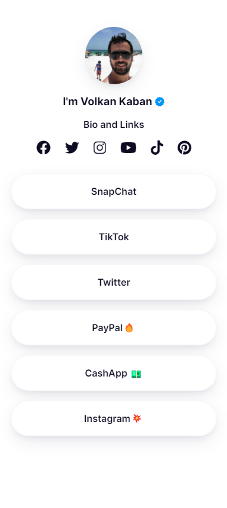
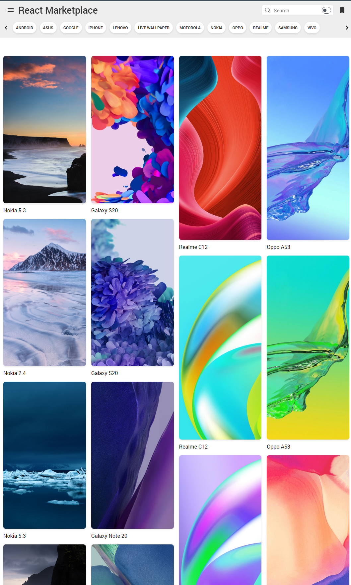
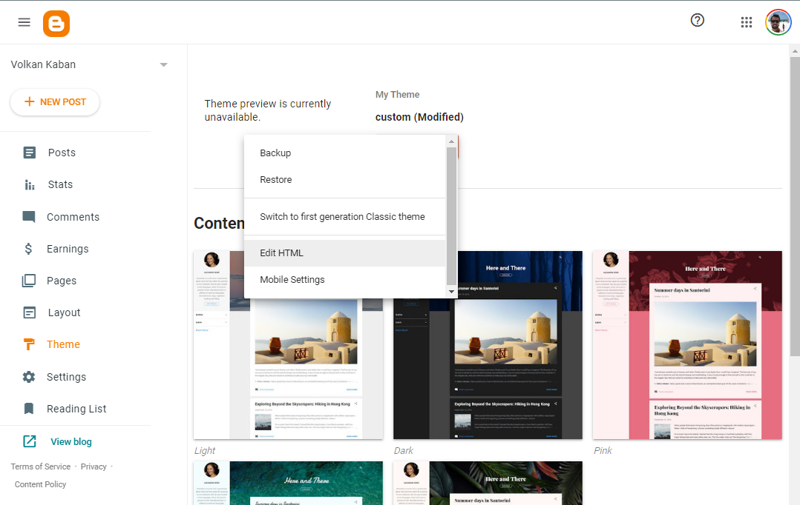
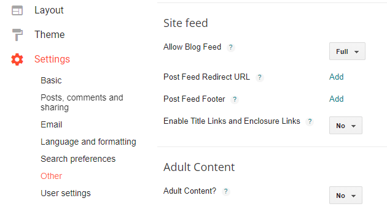

### React Blogger





GitHub Page: https://volkankaban.github.io/react-blogger/<br>
Blogger Default: https://volkankaban.blogspot.com/<br>
Blogger Profile: https://volkankabanprofile.blogspot.com/<br>
Blogger Gallery: https://volkankabangallery.blogspot.com/<br>
<br>
Blogger Theme: docs/default.xml<br>
Profile Theme: docs/profile.xml<br>
Gallery Theme: docs/gallery.xml<br>



Features | Status
:--- | :---
Fast Loading | :x:
Light/Dark Mode | :x:
Slider | :white_check_mark:
Video Player | :white_check_mark:
Thumbs Hover Player | :white_check_mark:
Infinite Scroll | :white_check_mark:
Social Sharing | :white_check_mark:
Header Search | :white_check_mark:
Featured | :white_check_mark:
Popular | :white_check_mark:
&nbsp;|

#### Blogger Preparation

Allow Blog Feed With ```Full``` Article



## Build & Development

```
npm run build
npm run start
```