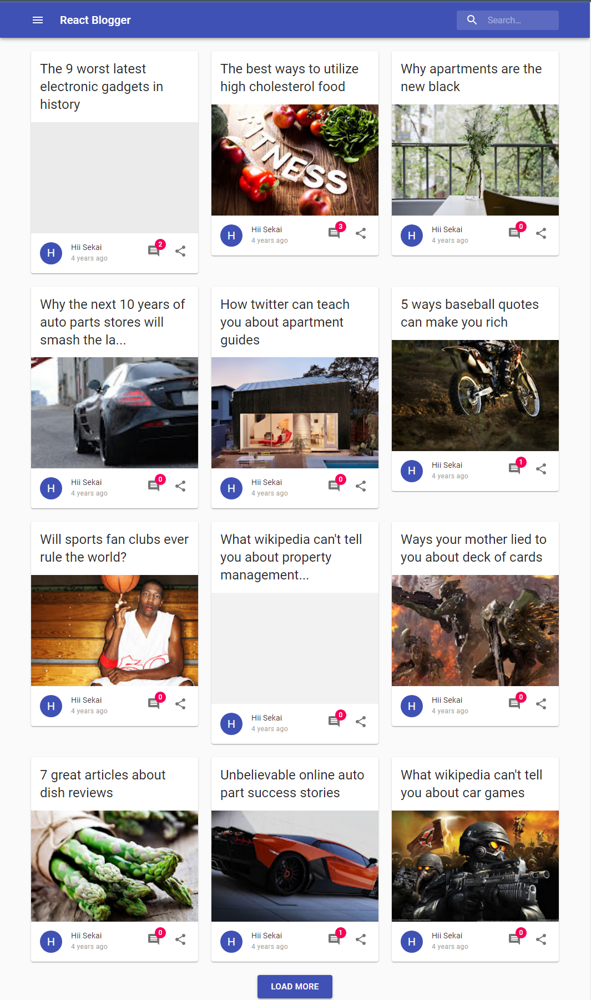
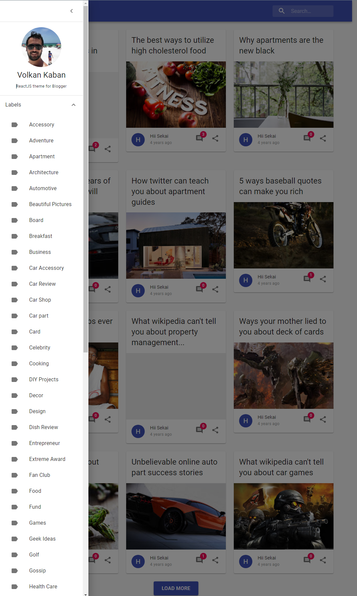

# React Blogger
React For Blogger With Material UI






<h3>Theme Features</h3>
| <b>Responsive</b> | :white_check_mark:<br>
| <b>Mobile Friendly</b> | <i>:white_check_mark:</i><br>
| <b>SEO Friendly</b> | <i>:white_check_mark:</i><br>
| <b>SMO friendly</b> | <i>:white_check_mark:</i><br>
| <b>Fast Loading</b> | <i>:white_check_mark:</i><br>
| <b>Customization</b> | <i>:white_check_mark:</i><br>
| <b>Documentation</b> | <i>:white_check_mark:</i><br>
| <b>RTL languages</b> | <i>:white_check_mark:</i><br>
| <b>Drop Down Menu</b> | <i>:white_check_mark:</i><br>
| <b>Multiple Versions</b> | <i>:white_check_mark:</i><br>
| <b>Recent Post Widget</b> | <i>:white_check_mark:</i><br>
| <b>Email Subscription</b> | <i>:white_check_mark:</i><br>
| <b>Social Sharing</b> | <i>:white_check_mark:</i><br>
| <b>Social Buttons</b> | <i>:white_check_mark:</i><br>
| <b>Related Posts</b> | <i>:white_check_mark:</i><br>
| <b>Search Widget</b> | <i>:white_check_mark:</i><br>
| <b>Featured Post</b> | <i>:white_check_mark:</i><br>
| <b>shortcode</b> | <i>:white_check_mark:</i><br>
| <b>Ads Ready</b> | <i>:x:</i><br>
| <b>Slider</b> | <i>:x:</i><br>
| <b>Video Player</b> | <i>:x:</i><br>
| <b>Dark Mode</b> | <i>:x:</i><br>

## Blogger Preparation

### Allow Blog Feed

Allow Blog Feed With ```Full``` Article


## Build

```
npm run build
```

## Development

```
npm run start
```
